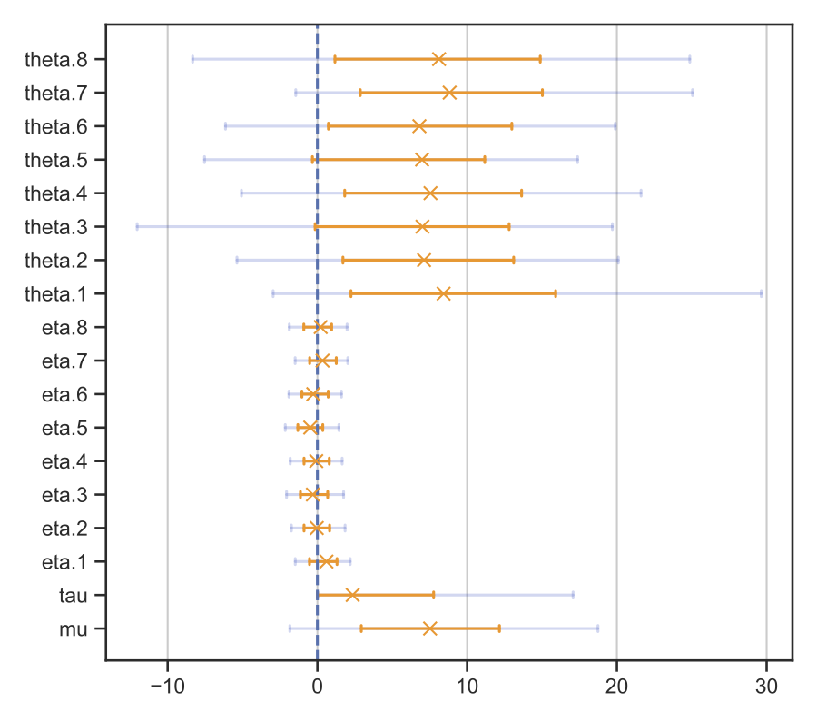
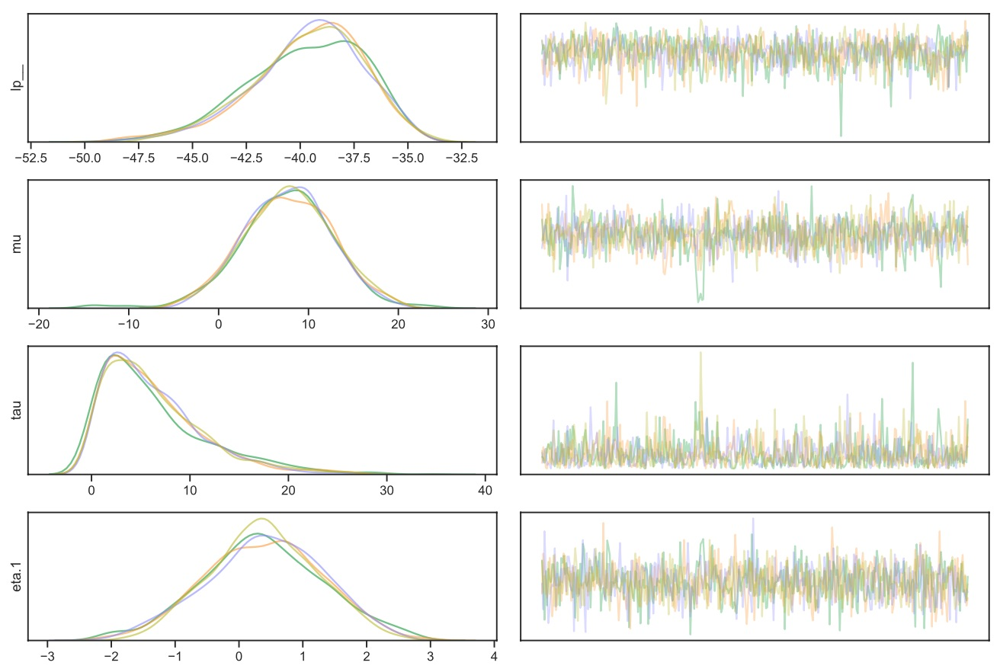
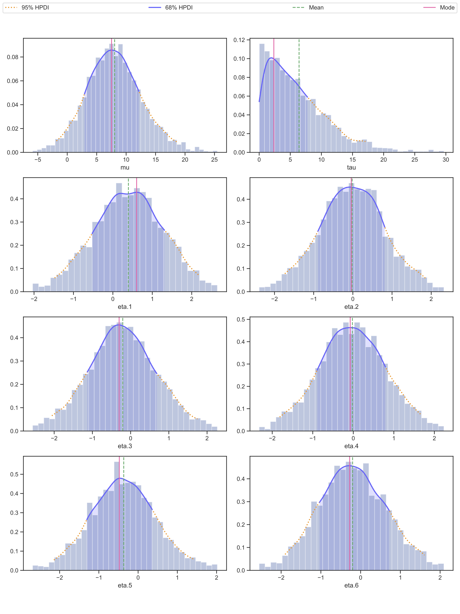

# A Python library for analysing cmdstanpy output

This is a collection of function for analysing output of [cmdstanpy](https://github.com/stan-dev/cmdstanpy) library. The main idea is to do a quick data analysis by calling a single function that makes:

* traceplots of samples,

* text and plots of the summaries of model parameters,

* histograms of posterior distributions of parameters.


*The only known illustration of a tarpan made from life, depicting a five month old colt (Borisov, 1841). Source: [Wikimedia Commons](https://commons.wikimedia.org/wiki/File:Tarpan.png).*


## Setup

First, install [cmdstanpy library](https://cmdstanpy.readthedocs.io/en/latest/index.html), and then do:

```
pip install tarpan
```

## Usage

### `save_analysis`

This is the main function of the library that analyses
Stan's output samples and saves results in
[model_info](docs/examples/analyse/a01_simple/model_info/analyse) directory.

```Python
from tarpan.cmdstanpy.analyse import save_analysis

model = CmdStanModel(stan_file="your_model.stan")
fit = model.sample(data=your_data)

save_analysis(fit)  # <-- Creates plots and summaries in `model_info` directory
```


### Sample code

See the [example code](docs/examples/analyse/a01_simple) of using `save_analysis` function. To run the example,
download analyse.py and eight_schools.stan files into the same directory and run

```
python analyse.py
```

The function generates the following files in [model_info/analyse](docs/examples/analyse/a01_simple/model_info/analyse) directory:


#### 1. Model's diagnostic info [diagnostic.txt](docs/examples/analyse/a01_simple/model_info/analyse/diagnostic.txt)

Stan's diagnostic output. Usually, this is the first thing I look at, to see if there were any problems with sampling.


#### 2. Text summary [summary.txt](docs/examples/analyse/a01_simple/model_info/analyse/summary.txt)

A table showing summaries of distributions for all parameters. The table's format is such that the text can be pasted in Github's Markdown file, like this:

| Name    |   Mean |   Std |   Mode |    + |    - |   68CI- |   68CI+ |   95CI- |   95CI+ |   N_Eff |   R_hat |
|:--------|-------:|------:|-------:|-----:|-----:|--------:|--------:|--------:|--------:|--------:|--------:|
| mu      |   7.88 |  4.90 |   7.09 | 5.46 | 4.23 |    2.85 |   12.54 |   -1.46 |   18.19 |    2438 |    1.00 |
| tau     |   6.58 |  5.64 |   2.16 | 5.72 | 2.16 |    0.00 |    7.88 |    0.00 |   17.44 |    1394 |    1.00 |
| eta.1   |   0.40 |  0.94 |   0.46 | 0.89 | 0.94 |   -0.49 |    1.35 |   -1.46 |    2.32 |    3811 |    1.00 |
| eta.2   |  -0.01 |  0.88 |  -0.05 | 0.84 | 0.86 |   -0.91 |    0.79 |   -1.82 |    1.76 |    4484 |    1.00 |

The summary columns are:

*  **Name, Mean, Std** are the name of the parameter, its mean and standard deviation.

*  **68CI-, 68CI+, 95CI-, 95CI+** are the 68% and 95% HPDIs (highest probability density intervals). These values are configurable, see below.

* **Mode, +, -** is a mode of distribution with upper and lower uncertainties, which are calculated as distances to 68% HPDI.

* **N_Eff** is Stan's number of effective samples, the higher the better.

* **R_hat** is a Stan's parameter representing the quality of the sampling. This value needs to be smaller than 1.00. After generating a model I usually immediately look at this R_hat column to see if the sampling was good.


#### 3. [summary.csv](docs/examples/analyse/a01_simple/model_info/analyse/summary.csv)

Same as summary.txt but in CSV format.


#### 4. Summary tree plot [summary.pdf](docs/examples/analyse/a01_simple/model_info/analyse/summary.pdf)

The plot of the summary. The error bars correspond to the 68% and 95% HPDIs:




#### 5. Traceplots: [traceplot_01.pdf](docs/examples/analyse/a01_simple/model_info/analyse/traceplot_01.pdf), [traceplot_02.pdf](docs/examples/analyse/a01_simple/model_info/analyse/traceplot_02.pdf), [traceplot_03.pdf](docs/examples/analyse/a01_simple/model_info/analyse/traceplot_03.pdf)

The traceplots of the samples for all parameters, the colors show samples from different chains. The first plot for "lp__" is the most important one, this is the traceplot of the log probability values. Usually, I look "lp__" traceplot to make sure the lines of different colors are well-mixed and are mostly concentrated at some value of the parameter, which means that the sampling converged.




#### 6. Histograms: [posterior_01.pdf](docs/examples/analyse/a01_simple/model_info/analyse/posterior_01.pdf), [posterior_02.pdf](docs/examples/analyse/a01_simple/model_info/analyse/posterior_02.pdf), [posterior_03.pdf](docs/examples/analyse/a01_simple/model_info/analyse/posterior_03.pdf)

These are histograms that show distributions of values for all parameters:




## Run unit tests

```
pytest
```


## The unlicense

This work is in [public domain](LICENSE).


## 🐴🐴🐴

This work is dedicated to [Tarpan](https://en.wikipedia.org/wiki/Tarpan), an extinct subspecies of wild horse.
