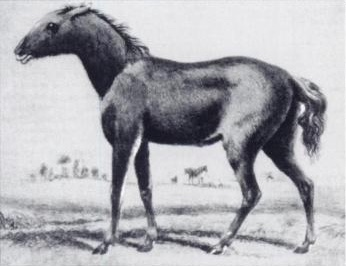

# A Python library for analysing cmdstanpy output

This is a collection of function for analysing output of [cmdstanpy](https://github.com/stan-dev/cmdstanpy) library. The main idea is to do a quick data analysis by calling a single function that makes:

* traceplots of samples,

* text and plots of the summaries of model parameters,

* histograms and pair plots of posterior distributions of parameters.




*The only known illustration of a tarpan made from life, depicting a five month old colt (Borisov, 1841). Source: [Wikimedia Commons](https://commons.wikimedia.org/wiki/File:Tarpan.png).*


## Setup

First, install [cmdstanpy library](https://cmdstanpy.readthedocs.io/en/latest/index.html), and then do:

```
pip install tarpan
```

## Usage

### Do complete analysis: `save_analysis`

This is the main function of the library that saves summaries
and trace/pair/tree plots in
[model_info](docs/examples/analyse/a01_simple/model_info/analyse) directory. See the [example code](docs/examples/analyse/a01_simple) of using `save_analysis` function and [description of its output files](docs/save_analysis/output).

```Python
from tarpan.cmdstanpy.analyse import save_analysis
model = CmdStanModel(stan_file="your_model.stan")
fit = model.sample(data=your_data)
save_analysis(fit, param_names=['mu', 'sigma'])
```


### Make tree plot: `save_tree_plot`

Function `save_tree_plot` creates a [tree plot](docs/examples/save_tree_plot/a01_single_fit/model_info/tree_plot/summary.pdf) in
model_info directory. See example code [here](docs/examples/save_tree_plot/a01_single_fit).

```Python
from tarpan.cmdstanpy.tree_plot import save_tree_plot
fit = CmdStanModel(stan_file="your_model.stan")
save_tree_plot([fit], param_names=['mu', 'sigma'])
```


#### Comparing multiple models on a tree plot

Supply multiple fits in order to compares parameters from multiple models. See example code [here](docs/examples/save_tree_plot/a02_compare_fits).

```Python
from tarpan.cmdstanpy.tree_plot import save_tree_plot
fit1 = CmdStanModel(stan_file="your_model1.stan")
fit2 = CmdStanModel(stan_file="your_model2.stan")

data = { "mu": 2.2, "tau": 1.3 }  # Add extra markers (optional)
save_tree_plot([fit1, fit2], extra_values=data, param_names=['mu', 'sigma'])
```


## Run unit tests

```
pytest
```


## The unlicense

This work is in [public domain](LICENSE).


## 🐴🐴🐴

This work is dedicated to [Tarpan](https://en.wikipedia.org/wiki/Tarpan), an extinct subspecies of wild horse.
