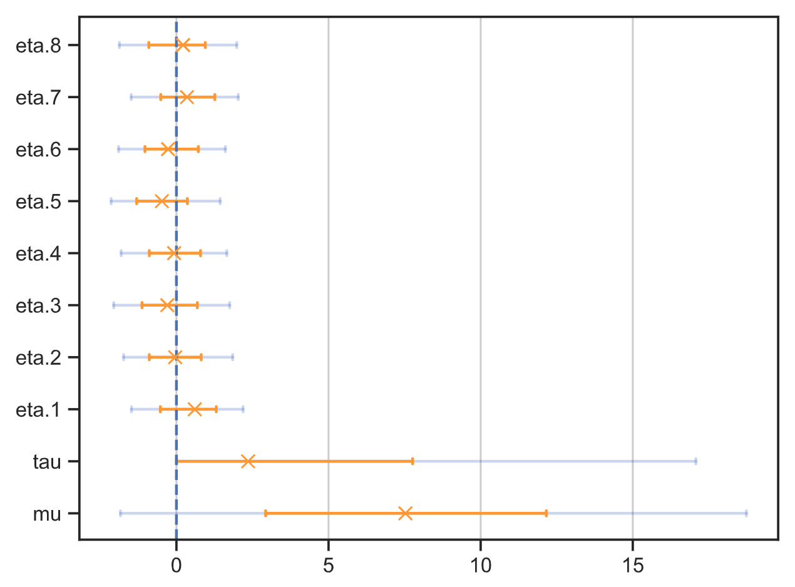

# A Python library for analysing cmdstanpy output

This is a collection of functions for analysing output of [cmdstanpy](https://github.com/stan-dev/cmdstanpy) library. The main idea is to do a quick data analysis by calling a single function that makes:

* traceplots of samples,

* text and plots of the summaries of model parameters,

* histograms and pair plots of posterior distributions of parameters.


*The only known illustration of a tarpan made from life, depicting a five month old colt (Borisov, 1841). Source: [Wikimedia Commons](https://commons.wikimedia.org/wiki/File:Tarpan.png).*


## Setup

First, run:

```
pip install tarpan
```


Finally, install [cmdstan](https://github.com/stan-dev/cmdstan) by running:

```
install_cmdstan
```


## Complete analysis: `save_analysis`

This is the main function of the library that saves summaries
and trace/pair/tree plots in
[model_info](docs/examples/analyse/a01_simple/model_info/analyse) directory.
The function is useful when you want to generate all types of summaries
and plots at once.

```Python
from tarpan.cmdstanpy.analyse import save_analysis

model = CmdStanModel(stan_file="your_model.stan")
fit = model.sample(data=your_data)
save_analysis(fit, param_names=['mu', 'sigma'])
```

* [Full example code](docs/examples/analyse/a01_simple)

If you don't need everything, you can call individual
functions described below to make just one type of plot or a summary.


## Summary: `save_summary`

Creates a summary of parameter distributions and saves it in text and CSV files.


```Python
from tarpan.cmdstanpy.summary import save_summary

model = CmdStanModel(stan_file="your_model.stan")
fit = model.sample(data=your_data)
save_summary(fit, param_names=['mu', 'tau', 'eta.1'])
```

* [Full example code](docs/examples/save_summary/a01_save_summary)

The text summary format is such that the text can be pasted into Github/Gitlab/Bitbucket's Markdown file, like this:

| Name   |   Mean |   Std |   Mode |    + |    - |   68CI- |   68CI+ |   95CI- |   95CI+ |   N_Eff |   R_hat |
|:-------|-------:|------:|-------:|-----:|-----:|--------:|--------:|--------:|--------:|--------:|--------:|
| mu     |   8.05 |  5.12 |   7.53 | 4.63 | 4.59 |    2.93 |   12.16 |   -1.84 |   18.74 |    1540 |    1.00 |
| tau    |   6.41 |  5.72 |   2.36 | 5.41 | 2.35 |    0.00 |    7.76 |    0.00 |   17.07 |    1175 |    1.00 |
| eta.1  |   0.39 |  0.92 |   0.60 | 0.71 | 1.13 |   -0.53 |    1.31 |   -1.48 |    2.19 |    3505 |    1.00 |


### Summary columns

*  **Name, Mean, Std** are the name of the parameter, its mean and standard deviation.

*  **68CI-, 68CI+, 95CI-, 95CI+** are the 68% and 95% HPDIs (highest probability density intervals). These values [are configurable](docs/hpdi.md).

* **Mode, +, -** is a mode of distribution with upper and lower uncertainties, which are calculated as distances to 68% HPDI.

* **N_Eff** is Stan's number of effective samples, the higher the better.

* **R_hat** is a Stan's parameter representing the quality of the sampling. This value needs to be smaller than 1.00. After generating a model I usually immediately look at this R_hat column to see if the sampling was good.


## Tree plot: `save_tree_plot`

This function shows exactly the same information as `save_summary`, but in
the form a plot. The markers are the modes of the distributions, and the two error bars
indicate 68% and 95% HPDIs (highest posterior density intervals).

```Python
from tarpan.cmdstanpy.tree_plot import save_tree_plot

model = CmdStanModel(stan_file="your_model.stan")
fit = model.sample(data=your_data)
save_tree_plot([fit], param_names=['mu', 'sigma'])
```

* [Full example code](docs/examples/save_tree_plot/a01_single_fit)




### Comparing multiple models on a tree plot

Supply multiple fits in order to compare parameters from multiple models.

```Python
from tarpan.cmdstanpy.tree_plot import save_tree_plot
from tarpan.shared.tree_plot import TreePlotParams

# Sample from two models
model1 = CmdStanModel(stan_file="your_model1.stan")
fit1 = model1.sample(data=your_data)
model2 = CmdStanModel(stan_file="your_model2.stan")
fit2 = model2.sample(data=your_data)

# Supply legend labels (optional)
tree_params = TreePlotParams()
tree_params.labels = ["Model 1", "Model 2", "Exact"]
data = [{ "mu": 2.2, "tau": 1.3 }]  # Add extra markers (optional)

save_tree_plot([fit1, fit2], extra_values=data, param_names=['mu', 'tau'],
               tree_params=tree_params)
```

* [Full example code](docs/examples/save_tree_plot/a02_compare_fits)


## Trace plot: `save_traceplot`

The plot shows the values of parameters samples.
Different colors correspond to samples form different chains. Ideally,
the lines of different colors on the left plots are well mixed, and the
right plot is fairly uniform.


```Python
from tarpan.cmdstanpy.traceplot import save_traceplot

model = CmdStanModel(stan_file="your_model.stan")
fit = model.sample(data=your_data)
save_traceplot(fit, param_names=['mu', 'tau', 'eta.1'])
```

* [Full example code](docs/examples/save_traceplot/a01_save_traceplot)


## Pair plot: `save_pair_plot`

The plot helps to see correlations between parameters and spot funnel
shaped distributions that can result in sampling problems.

```Python
from tarpan.cmdstanpy.pair_plot import save_pair_plot
model = CmdStanModel(stan_file="your_model.stan")
fit = model.sample(data=your_data)
save_pair_plot(fit, param_names=['mu', 'tau', 'eta.1'])
```

* [Full example code](docs/examples/save_pair_plot/a01_pair_plot)


## Histogram: `save_histogram`

Show histograms of parameter distributions.

```Python
from tarpan.cmdstanpy.histogram import save_histogram
model = CmdStanModel(stan_file="your_model.stan")
fit = model.sample(data=your_data)
save_histogram(fit, param_names=['mu', 'tau', 'eta.1', 'theta.1'])
```

* [Full example code](docs/examples/save_histogram/a01_save_histogram)


## Saving cmdstan samples to disk

It saves a lot of time to sample the model and save the results to disk, so
they can be used on the next run instead of waiting for the sampling again.
This can be done with `run` function:

```python
from tarpan.cmdstanpy.cache import run

# Your function that creates CmdStanModel, runs its `sample` method
# and returns the result.
#
# This function must take `output_dir` input parameter and pass it to `sample`.
#
# It may also have any other parameters you wish to pass from `run`.
def run_stan(output_dir, other_param):
    model = CmdStanModel(stan_file="my_model.stan")

    fit = model.sample(
        data=data,
        output_dir=output_dir  # Pass to make CSVs in correct location
    )

    return fit  # Return the fit

# Will run `run_stan` once, save model to disk and read it on next calls
fit = run(func=run_stan, other_param="some data")
```

* [Full example code](docs/examples/run/a01_run)


## KDE with uncertainties

The `kde` function helps to plot KDE (kernel density estimate) curve that takes into account uncertainties of observations:

```python
from tarpan.shared.stats import kde
import numpy as np

x = np.linspace(0, 1, 100)
y = kde(x, values, uncert)
ax2.fill_between(x, y)
```


## Common questions

* [How to change the widths of HPD intervals?](docs/hpdi.md)

* [Where are plot/summary files placed and how to change that?](docs/file_names.md)


## Run unit tests

```
pytest
```


## The unlicense

This work is in [public domain](LICENSE).


## 🐴🐴🐴

This work is dedicated to [Tarpan](https://en.wikipedia.org/wiki/Tarpan), an extinct subspecies of wild horse.
